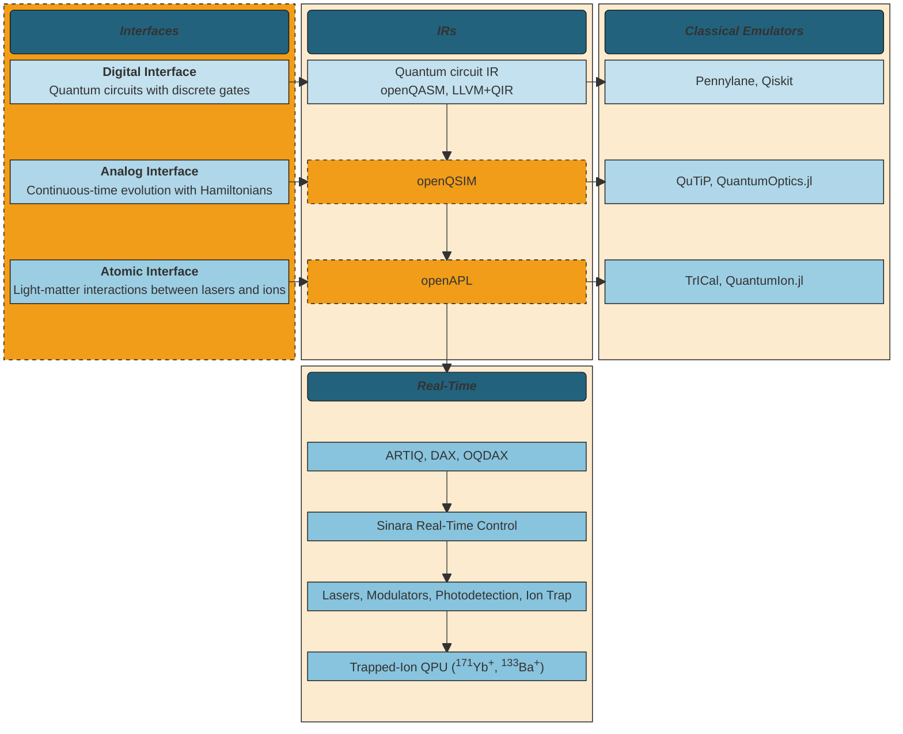

# 

  
  

    <h2 align="center">
    Open Quantum Design: Core
    </h2>

### Where in the stack

```mermaid
block-beta
   columns 3

   block:Interface
       columns 1
       InterfaceTitle("<i><b>Interfaces</b><i/>")
       InterfaceDigital["<b>Digital Interface</b>\nQuantum circuits with discrete gates"]
       space
       InterfaceAnalog["<b>Analog Interface</b>\n Continuous-time evolution with Hamiltonians"]
       space
       InterfaceAtomic["<b>Atomic Interface</b>\nLight-matter interactions between lasers and ions"]
       space
    end

    block:IR
       columns 1
       IRTitle("<i><b>IRs</b><i/>")
       IRDigital["Quantum circuit IR\nopenQASM, LLVM+QIR"]
       space
       IRAnalog["openQSIM"]
       space
       IRAtomic["openAPL"]
       space
    end

    block:Emulator
       columns 1
       EmulatorsTitle("<i><b>Classical Emulators</b><i/>")

       EmulatorDigital["Pennylane, Qiskit"]
       space
       EmulatorAnalog["QuTiP, QuantumOptics.jl"]
       space
       EmulatorAtomic["TrICal, QuantumIon.jl"]
       space
    end

    space
    block:RealTime
       columns 1
       RealTimeTitle("<i><b>Real-Time</b><i/>")
       space
       RTSoftware["ARTIQ, DAX, OQDAX"]
       space
       RTGateware["Sinara Real-Time Control"]
       space
       RTHardware["Lasers, Modulators, Photodetection, Ion Trap"]
       space
       RTApparatus["Trapped-Ion QPU (<sup>171</sup>Yb<sup>+</sup>, <sup>133</sup>Ba<sup>+</sup>)"]
       space
    end
    space

   InterfaceDigital --> IRDigital
   InterfaceAnalog --> IRAnalog
   InterfaceAtomic --> IRAtomic

   IRDigital --> IRAnalog
   IRAnalog --> IRAtomic

   IRDigital --> EmulatorDigital
   IRAnalog --> EmulatorAnalog
   IRAtomic --> EmulatorAtomic

   IRAtomic --> RealTimeTitle

   RTSoftware --> RTGateware
   RTGateware --> RTHardware
   RTHardware --> RTApparatus

   classDef title fill:#23627D,stroke:#141414,color:#FFFFFF;
   classDef digital fill:#c3e1ee,stroke:#141414,color:#141414;
   classDef analog fill:#afd7e9,stroke:#141414,color:#141414;
   classDef atomic fill:#9ccee3,stroke:#141414,color:#141414;
   classDef realtime fill:#88c4dd,stroke:#141414,color:#141414;

    classDef highlight fill:#F19D19,stroke:#141414,color:#141414,stroke-dasharray: 5 5;
    classDef normal fill:#fcebcf,stroke:#141414,color:#141414;

    class InterfaceTitle,IRTitle,EmulatorsTitle,RealTimeTitle title
    class InterfaceDigital,IRDigital,EmulatorDigital digital
    class InterfaceAnalog,IRAnalog,EmulatorAnalog analog
    class InterfaceAtomic,IRAtomic,EmulatorAtomic atomic
    class RTSoftware,RTGateware,RTHardware,RTApparatus realtime

   class Interface,IRAnalog,IRAtomic highlight

   class Emulator normal
   class IR normal
   class RealTime normal

```
The highlighted stack components are contained in this repository.
