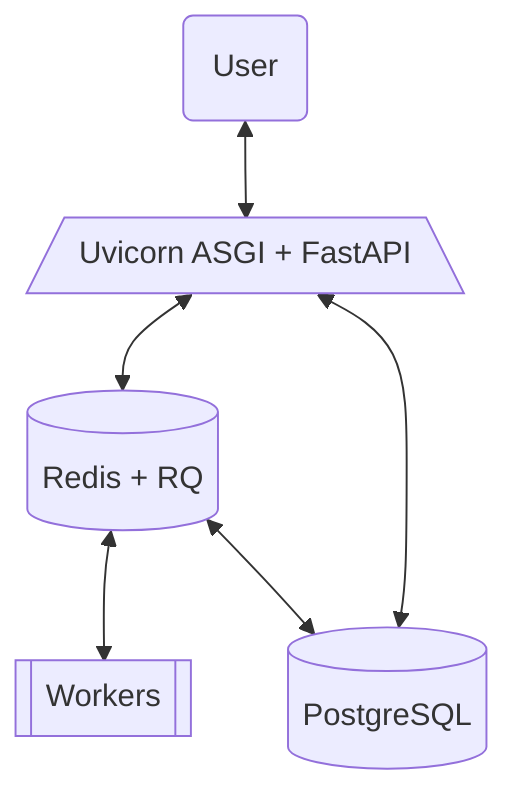

## Server-side

### Architecture


### Deployment
The web server for running quantum experiments can be deployed with docker with the following commands:
```bash
cd docker
docker-compose up -d --build
```

### Users
The users table is stored on the PostgreSQL database. 

| User ID | Username | Email | Hashed Password | Created At | Disabled |
|---------|----------|-------|-----------------|------------|----------|
|---------|----------|-------|-----------------|------------|----------|


### Jobs
The jobs table is stored on the PostgreSQL database. 

| Job ID | Status | Task | Backend | Result | User ID |
|--------|--------|------|---------|--------|---------|
|--------|--------|------|---------|--------|---------|

The jobs are queued and executed with Redis queue and workers, when finished the results are posted to the jobs table.


## Client-side
=== "Client"
    ```python
    client = Client()
    provider = Provider(url=f"http://{host}:{port}")
    ``` 

### Registration
=== "Request"
    ```python
    request.post(
        url=f"http://{host}:{port}/user/registration",
        json=registration_form,
    )
    ```

### Authentication
=== "Client"
    ```python
    client.connect(provider:Provider, backend:str)
    ```
=== "Request"
    ```python
    request.post(
        url=f"http://{host}:{port}/auth/token",
        json=login_form,
    )
    ```
    In return, a JSON web token (JWT) is returned to the user.
    ```json
    {
        "id" : "-----",
        "sub" : "-----",
        "exp" : "-----"
    }
    ```

### Submit job
=== "Client"
    ```python
    client.submit(task:Task, backend:str)
    ```
=== "Request"
    ```python
    request.post(
        url=f"http://{host}:{port}/submit/{backend}",
        json=task,
        headers=dict(Authorization=f"{jwt.token_type} {jwt.access_token}"),
    )
    ```

### Retrieve job
=== "Client"
    ```python
    client.retrieve(job_id:str)
    ```
=== "Request"
    ```python
    request.get(
        url=f"http://{host}:{port}/retrieve/{job_id}",
        headers=dict(Authorization=f"{jwt.token_type} {jwt.access_token}"),
    )
    ```

### Cancel job
=== "Client"
    ```python
    client.cancel(job_id:str)
    ```
=== "Request"
    ```python
    request.put(
        url=f"http://{host}:{port}/cancel/{job_id}",
        headers=dict(Authorization=f"{jwt.token_type} {jwt.access_token}"),
    )
    ```